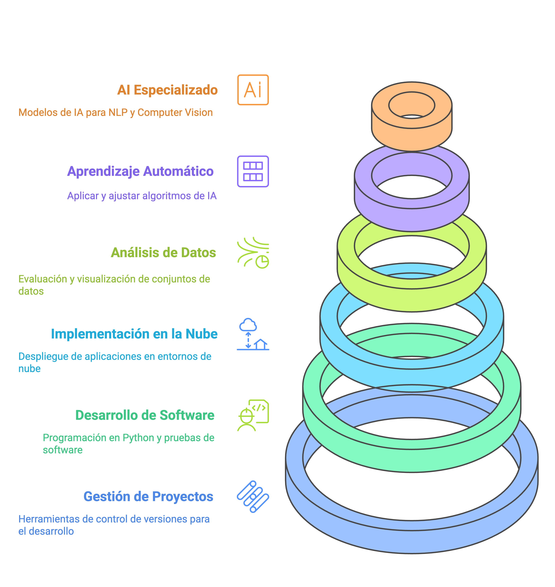

# Bootcamp 

Este repositorio contiene la visión general del Bootcamp de Inteligencia Artificial de Factoría F5 Madrid (Promoción 5). 

## 🎯 Infografía de Competencias

- Esta infografía, generada con IA, proporciona una visión general de las competencias 

## 📊 Diagrama de Gantt

- Visión de secuencia de temas, proyectos y certificaciones

## 📅 Calendario vinculado con Google Calendar

  - Sesiones diarias, Eventos especiales, Masterclass, Fechas de entrega de proyectos, etc.

## 🔗 Centraliza enlaces esenciales

- Zoom, Moodle, Discord, etc.

## 🎯 Desglose de competencias

- Contenido de la competencias, niveles, criterios de evaluación, etc.

## ⭐️ Centraliza Información relevante 

- Horario, sistema de evaluación, material de interés

## 💫 Sigue la Identidad Corporativa F5

- Colores corporativos, Logos, etc.

## 🧠 Construido en Github

Este dashboard está en constante evolución. Como formador puedes:
1. Proponer mejoras mediante issues
2. Contribuir directamente mediante pull requests
3. Solicitar nuevas funcionalidades
4. Duplicar y personalizar para tu grupo
5. Visualizar con Github Pages o desplegando en un server

---
Desarrollado por el equipo de formación de Factoría F5 Madrid
